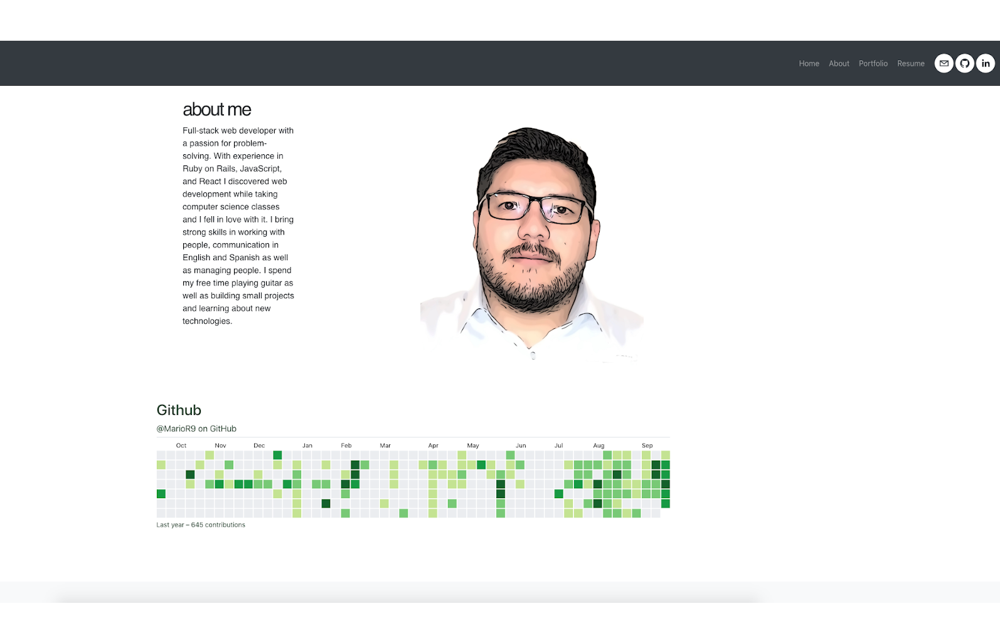
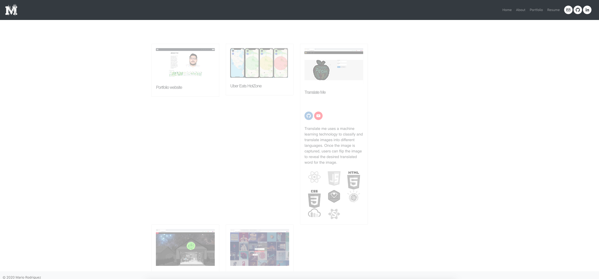

## Portfolio website

&nbsp;
&nbsp; 

## Portfolio website

&nbsp;

## Table of contents
* [General info](#general-info)
* [Technologies](#technologies)
* [images](#images)

## General info

It is a single page application powered by React, HTML, CSS, and Bootstrap UI. The website is host by firebase. Multiple pages containing information about me and some of my projects.
	
## Technologies

Project is created with:
* React 
* HTML
* CSS
* BootstrapUI

## Images

##### Main 
 

##### Projects 
 

